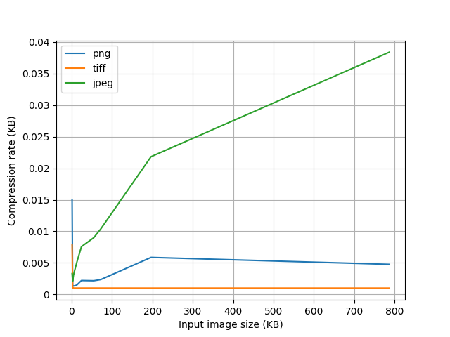
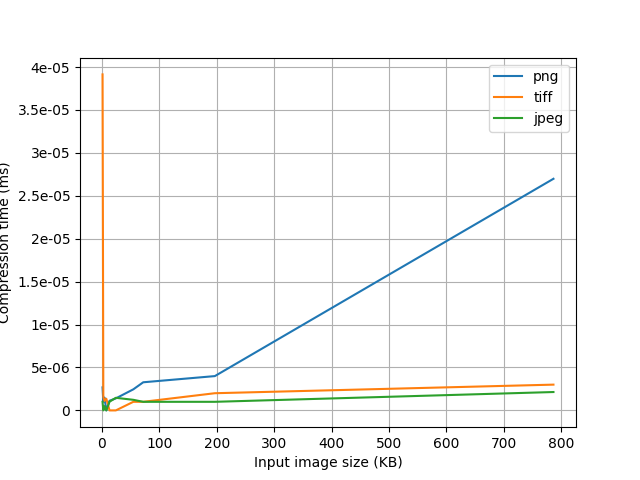

# Project Description
Project for the course Advanced Signal Processing. Subject of the master's degree in telecommunications engineering. University of Seville.

## compression_png.py
The script consists of compressing a group of bytes following the RFC:
Boutell, T. (1997). PNG (Portable Network Graphics) Specification Version 1.0. En RFC. https://doi.org/10.17487/rfc208

## compare.py
The script consists of comparing the speed and compression level of "png", "jpeg" and "tiff".

Results:

